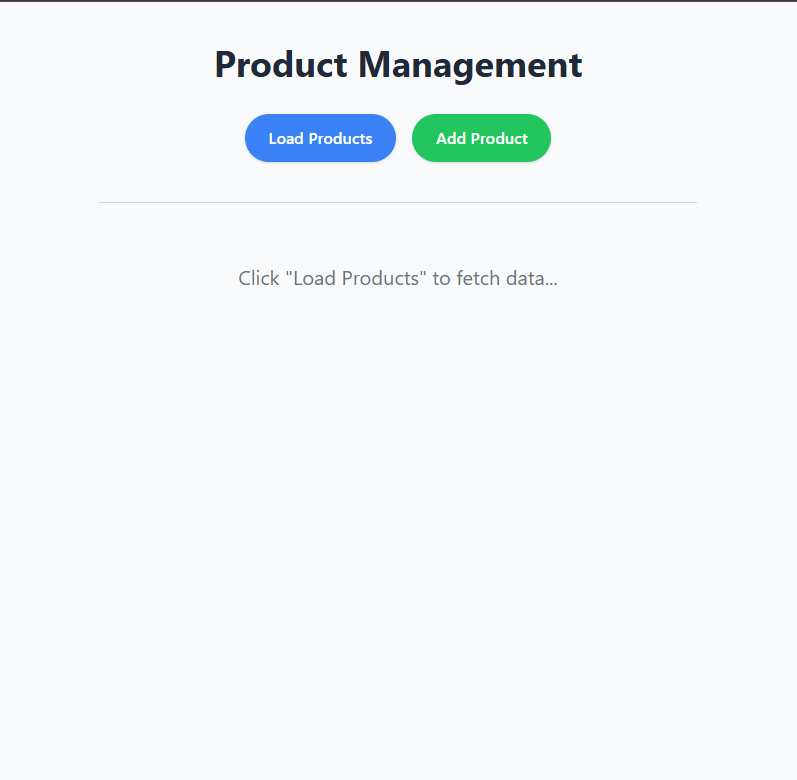
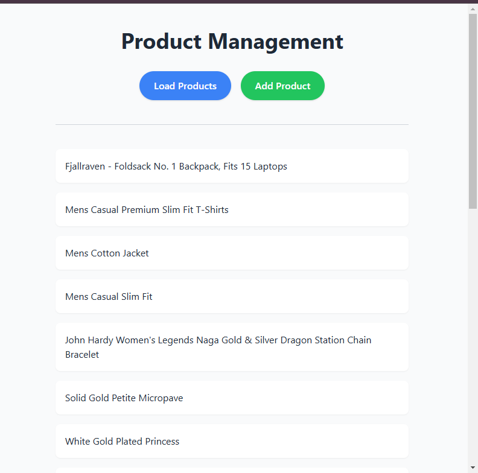

# **Axios Integration App**

A simple React application for managing products using the [Fake Store API](https://fakestoreapi.com). The app demonstrates the use of `axios` for making API requests and is styled with **Tailwind CSS** for a clean, minimalist design.

---

## **Features**

- **Fetch Products**: Retrieve a list of products from the API and display them in a visually appealing card format.
- **Add Product**: Add a new product to the store using a POST request.
- **Responsive Design**: Ensures the app looks great on both desktop and mobile devices.

---
## **Screenshots**





## **Installation**

1. Clone the repository:
   ```bash
   git clone https://github.com/your-username/product-management-app.git
